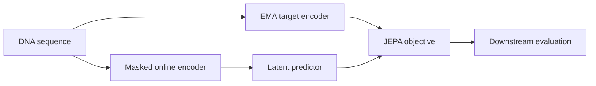

# JEPA-GLM

**Testing joint-embedding predictive objectives for genomic language-model adaptation.**

유전체 언어모델에 JEPA 학습을 결합하고, downstream 성능과 표현 학습의 한계를 대조 실험으로 확인한 연구입니다.

## What is implemented

- DNA tokenization and contiguous-span masking.
- Online encoder, EMA target encoder, latent prediction, and optional MLM loss.
- Synthetic smoke training, checkpointing, configurable backbone adaptation, linear probes, fine-tuning, and variant evaluation.
- Recorded controlled comparisons, including negative findings rather than an assumed JEPA advantage.



## Quick start: small synthetic run

Python 3.11+.

```bash
python -m venv .venv
# Activate .venv using your operating system's command.
python -m pip install -e ".[dev]"
jepa-glm-smoke --config configs/pretrain_jepa.yaml
python -m pytest tests -q
```

The smoke configuration uses synthetic DNA and a small local encoder; no pretrained checkpoint download is required. For DNABERT-based experiments, install the `hf` optional dependencies and obtain the model/data separately.

## Research artifacts


- [Experiment protocol](docs/EXPERIMENT_PROTOCOL.md)
- [Last-layer adaptation findings](docs/LAST_LAYER_ADAPTATION_FINDINGS.md)
- [Variant reproduction notes](docs/LAST_LAYER_VARIANT_REPRODUCTION.md)
- [Figure data](outputs/comprehensive_negative_figures/figure1_plot_data.csv)

## Repository map

`src/jepa_glm/` contains the model, data, loss, training, evaluation, and retained experiment utilities. `configs/` defines experiments; `tests/` checks core behavior. The original workspace's manuscript-generation and submission-administration pipelines are intentionally outside this compact source release.

## Scope

A runnable implementation is distinct from a demonstrated improvement. Consult the recorded evaluations for dataset, split, compute-budget, and statistical limitations. The figure summarizes historical measurements; full training was not rerun for this publication.

## Publication and validation

This is a curated research source snapshot, not the complete local experiment archive.
See [validation](VALIDATION.md), [publication scope](PUBLICATION_NOTES.md), and [credential handling](SECURITY.md).
