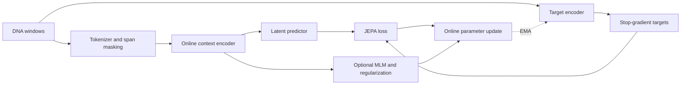
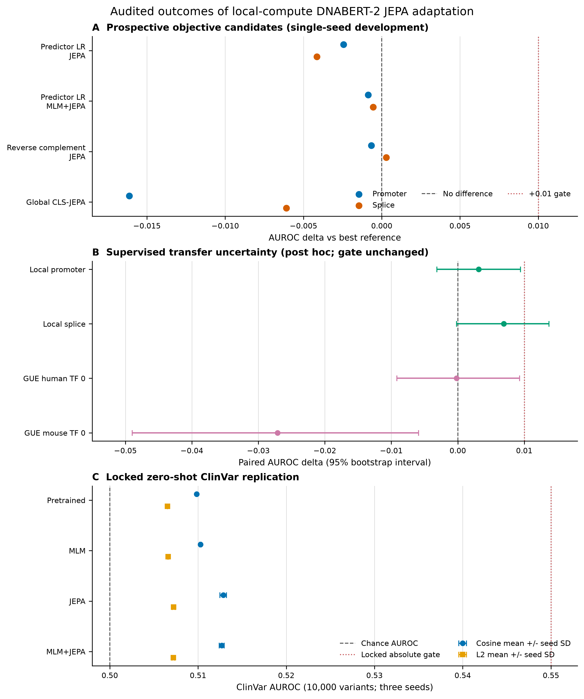
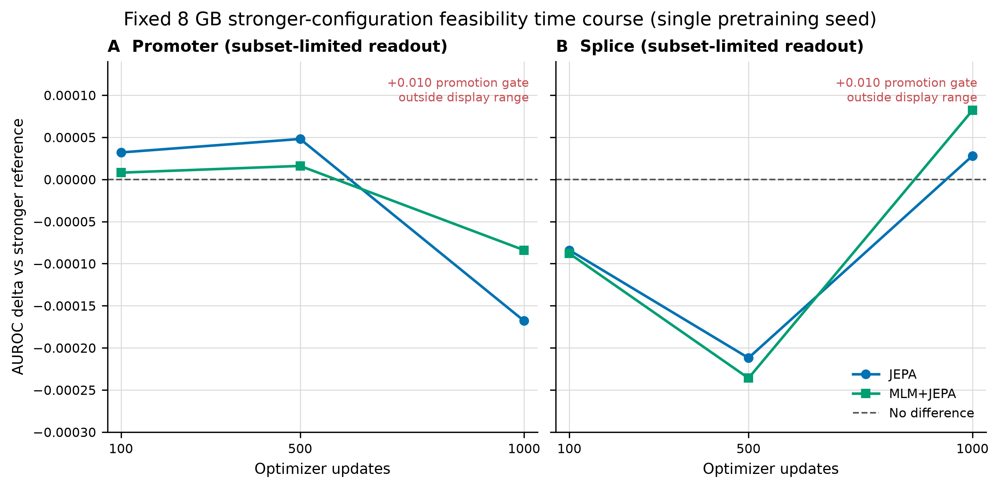
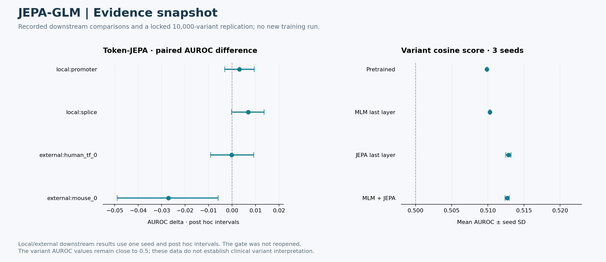

# JEPA-GLM

**유전체 언어모델에 JEPA 기반 표현 예측을 적용하고 downstream 효과를 검증하는 연구**

> Testing joint-embedding predictive objectives for genomic language-model adaptation.

이 프로젝트는 DNA token을 직접 복원하는 학습과 latent representation을 예측하는 학습을 비교한다. Joint Embedding Predictive Architecture(JEPA)를 유전체 언어모델에 적용하는 실행 가능한 구성 요소를 만들고, promoter·splice·외부 분류 과제 및 변이 점수 평가에서 추가 학습의 효과를 조사한다. 구현이 동작하는지와 실제 예측 성능이 개선되는지는 별도 기준으로 다룬다.

| 항목 | 내용 |
|---|---|
| 연구 분야 | Genomic representation learning, self-supervised learning |
| 핵심 구조 | Online encoder, EMA target encoder, latent predictor |
| 학습 구성 | JEPA, optional MLM, representation regularization |
| 주요 기술 | Python, PyTorch, DNA masking, checkpointing, downstream evaluation |
| 공개본 | 학습·평가 핵심 코드, 작은 synthetic 실행, 설정과 대표 결과 |

## 1. 연구 배경과 질문

MLM은 가려진 token의 정답을 복원하도록 학습한다. JEPA는 target encoder가 만든 표현을 예측하도록 구성할 수 있다. 그러나 latent prediction loss가 감소했다고 해서 생물학적 기능 예측에 유용한 표현을 얻었다고 단정할 수는 없다.

연구에서는 다음 문제를 나누어 확인한다.

1. DNA span masking과 EMA target encoder를 결합한 학습이 안정적으로 실행되는가?
2. 사전학습 모델과 MLM 대조군에 비해 downstream 분류가 좋아지는가?
3. Global pooled target과 token 수준 target, 학습률, freeze 범위의 변화가 결과에 어떤 영향을 주는가?
4. 하나의 local 과제에서 관찰한 차이가 외부 과제나 변이 점수 평가에서도 유지되는가?
5. 작은 개선을 반복·불확실성·개발 단계의 선택 과정과 함께 해석하면 어떤 결론을 낼 수 있는가?

## 2. 학습 구조



Online 경로는 가려진 입력에서 표현을 만들고 predictor가 target 표현을 예측한다. Target encoder는 EMA로 갱신되며 target 쪽 gradient 흐름을 분리한다. 설정에 따라 MLM과 정규화 항을 함께 사용한다. 작은 local encoder와 pretrained backbone을 같은 실험 구성에서 다룰 수 있도록 wrapper와 tokenizer 설정을 분리했다.

## 3. 구현된 구성 요소

| 기능 | 목적 |
|---|---|
| Synthetic DNA / manifest dataset | 모델 download 없이 기본 동작 검사; 실제 window 데이터와 연결 |
| Contiguous-span masking | 독립 token masking과 다른 문맥 결손 조건 구성 |
| Backbone wrapper와 freeze 설정 | 학습 가능한 encoder 범위 제어 |
| EMA target encoder | Online 경로와 분리된 target 표현 제공 |
| Predictor / pooling / loss | 표현 예측 방식과 학습 목적 구성 |
| Checkpoint / resume | 학습 상태 저장과 재개 |
| Linear probe / fine-tuning | 표현 품질과 downstream 적응 성능 평가 |
| Variant evaluation | 참조·대체 서열 표현을 이용하는 변이 점수 평가 |

## 4. 실험과 대표 결과 읽기

연구 자료에는 개발 실험, 외부 task 평가, 고정된 변이 평가, 제한된 계산 예산의 feasibility 실험이 함께 있다. 이들은 서로 다른 근거 수준이므로 하나의 성공률로 합치지 않는다.

### Downstream 비교

[Figure 1의 원자료](outputs/comprehensive_negative_figures/figure1_plot_data.csv)는 predictor 학습률 조정, reverse-complement 조건, global CLS-JEPA 및 token-JEPA 비교를 담는다. Token-JEPA의 기록된 paired AUROC 차이는 다음과 같다.

| 평가 과제 | AUROC 차이 | 해석 조건 |
|---|---:|---|
| Local promoter | +0.003140000000 | 단일 seed, 사후 구간 분석 |
| Local splice | +0.006920000000 | 단일 seed, 사후 구간 분석 |
| External human_tf_0 | −0.000192621010 | 단일 seed, 외부 과제 |
| External mouse_0 | −0.027116059173 | 단일 seed, 외부 과제 |

양의 point estimate만으로 재현 가능한 개선을 주장하지 않는다. 원자료의 구간과 boundary 열에는 사후 분석이며 기존 gate를 다시 열지 않았다는 조건이 명시되어 있다. Local과 external 과제의 결과 방향도 동일하지 않다.

### 고정된 변이 평가

같은 Figure 1의 **10,000-variant locked replication, 3 seeds**에서 cosine 점수 기반 mean AUROC는 다음과 같다.

| 표현 경로 | Mean AUROC |
|---|---:|
| Pretrained GLM | 0.509853960000 |
| MLM, last layer | 0.510273880000 |
| JEPA, last layer | 0.512858326667 |
| MLM + JEPA, last layer | 0.512684993333 |

값의 차이가 존재하더라도 절대 AUROC가 낮다는 점을 함께 보아야 한다. 이 결과만으로 임상 변이 해석 능력이 확보되었다고 말할 수 없다. 원자료에는 L2 점수와 seed SD도 포함되어 있다.



### 계산 예산을 고정한 학습 경과

아래 그림은 고정된 계산 예산에서 optimizer update 수에 따른 변화를 보여준다. 세부 결과는 [원자료](outputs/comprehensive_negative_figures/figure2_plot_data.csv)에서 확인할 수 있다.



이 분석은 single-seed, subset-limited feasibility 조건이다. 학습을 더 오래 수행한 결과를 확증 실험이나 반복 seed의 일반적 결론과 혼동하지 않는다.

## 5. 바로 실행하는 synthetic smoke test

**Python 3.11+**가 필요하다.

```bash
git clone https://github.com/CHOMINWOO1/JEPA-GLM.git
cd JEPA-GLM
python -m venv .venv
```

가상환경 활성화 후 다음을 실행한다.

```bash
python -m pip install -e ".[dev]"
jepa-glm-smoke --config configs/pretrain_jepa.yaml
python -m pytest tests -q
```

[기본 설정](configs/pretrain_jepa.yaml)은 synthetic DNA **128개**, sequence length **128**, batch size **4**, 학습 **8 steps**, mask ratio **0.30**, span length **12**, EMA momentum **0.996**을 사용한다. Backbone 이름이 비어 있는 작은 local encoder를 사용하므로 사전학습 가중치 download가 필요하지 않다.

기본 실행은 `outputs/`에 checkpoint와 step metric·summary를 생성한다. 이 smoke run의 loss 감소는 실행 점검이며, 위의 downstream 결과를 재현한 것이 아니다.

## 6. Pretrained 모델과 downstream 실험

DNABERT 기반 실험에는 별도 모델·데이터 준비가 필요하며 `hf` optional dependency를 설치한다.

```bash
python -m pip install -e ".[dev,hf]"
jepa-glm-run-training --help
jepa-glm-linear-probe --help
jepa-glm-finetune --help
```

Task와 split, checkpoint, freeze 범위를 [실험 프로토콜](docs/EXPERIMENT_PROTOCOL.md)에 맞춰 지정한다. 작은 synthetic 설정을 실제 데이터 평가의 설정으로 그대로 취급하지 않는다. [Last-layer findings](docs/LAST_LAYER_ADAPTATION_FINDINGS.md)와 [variant 재현 문서](docs/LAST_LAYER_VARIANT_REPRODUCTION.md)는 원래 연구 작업 공간의 추가 산출물을 참조할 수 있다.

## 7. 코드 탐색

| 위치 | 내용 |
|---|---|
| [data/](src/jepa_glm/data/) | Tokenizer, masking, DNA dataset |
| [models/](src/jepa_glm/models/) | Context/target encoder, predictor, backbone, pooling |
| [losses/](src/jepa_glm/losses/) | 학습 목적과 정규화 구성 |
| [training/](src/jepa_glm/training/) | Trainer, checkpoint와 학습 상태 처리 |
| [evaluation/](src/jepa_glm/evaluation/) | Downstream 및 변이 평가 |
| [cli/](src/jepa_glm/cli/) | 공개본에서 유지한 실행 진입점 |
| [tests/](tests/) | Masking, loss, backbone, dataset, checkpoint 테스트 |

## 8. 검증과 연구적 의미

공개본의 **26개 테스트가 통과**했고, CPU에서 synthetic **8-step** 학습이 완료되었다. 대규모 학습을 재실행하거나 새로운 성능 개선을 얻었다는 의미는 아니다.

이 프로젝트는 새로운 학습 목적을 구현한 뒤, 적절한 대조군·외부 과제·변이 평가를 통해 기대와 관측 결과의 차이를 확인하는 연구 과정을 담는다. 제한된 효과와 부정적 결과도 최종 연구 결론의 일부로 유지한다. 원래 작업 공간의 원고 생성·투고 행정 파이프라인은 이 공개본에서 제외했다.


## 시각화된 결과와 진행 상태



[상세 결과·진행 상태·보완 과제·보안 범위](docs/portfolio-results/README.md)에서 근거 자료와 재현 코드를 확인할 수 있다.

## 공개 범위와 추가 문서

이 저장소는 원래 작업 폴더에서 핵심 코드·테스트·설정·작은 예제·대표 결과를 선별한 공개본이다. 대용량 데이터·가중치, 인증정보, 내부 실행 기록과 중복 문서 생성 산출물은 제외했다. 기존 논문·실험 수치는 기록된 결과이며 이번 README 개정에서 재측정하지 않았다.

- [실행한 검증과 한계](VALIDATION.md)
- [공개본 구성과 재사용 조건](PUBLICATION_NOTES.md)
- [인증정보와 로컬 설정 관리](SECURITY.md)

초기 공개본에는 별도 오픈소스 재사용 라이선스를 부여하지 않았다. 제3자 모델·데이터·의존성은 각 원 출처의 이용 조건을 따른다.
